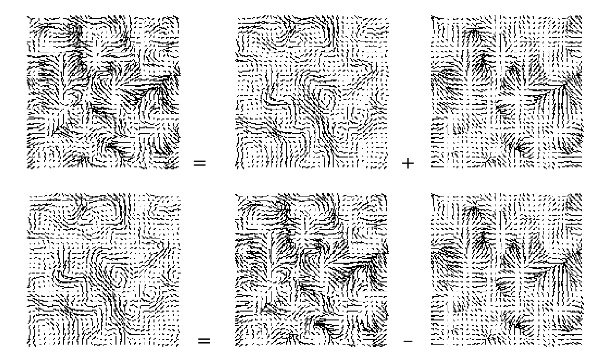
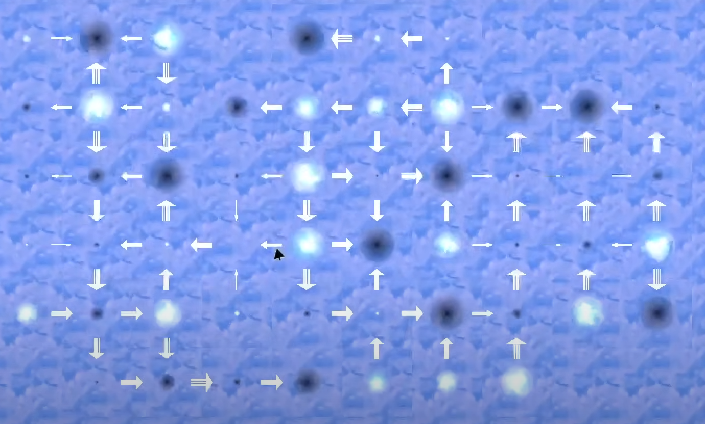
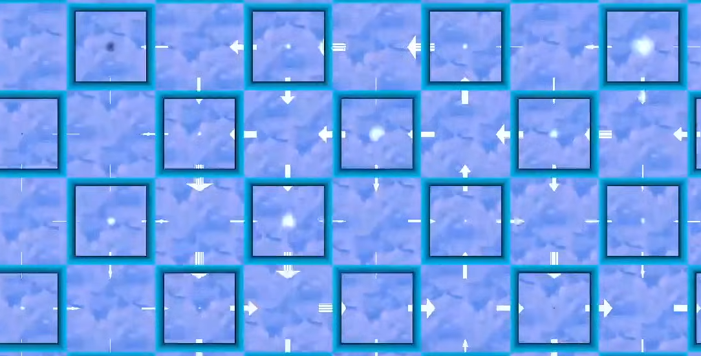
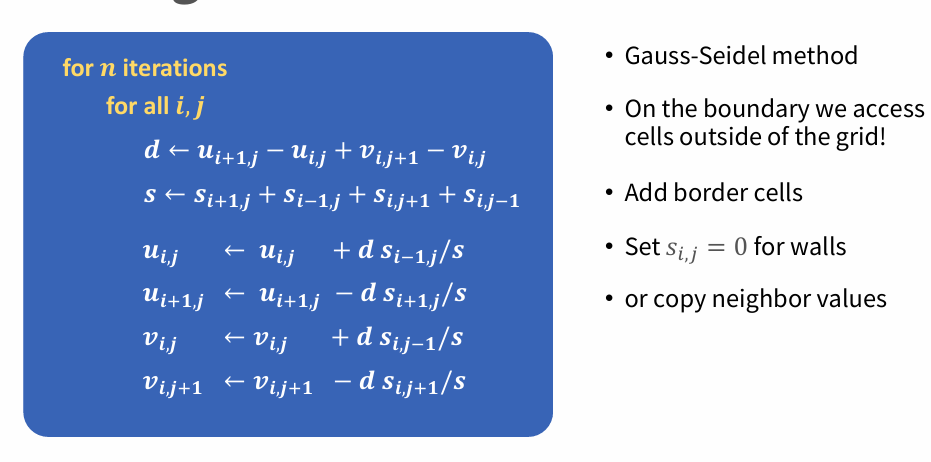
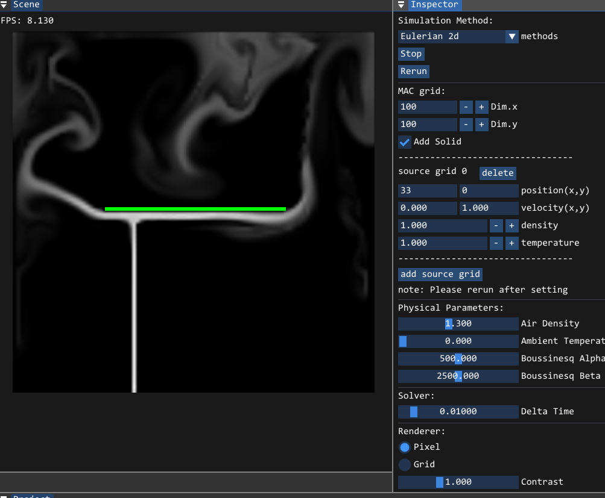
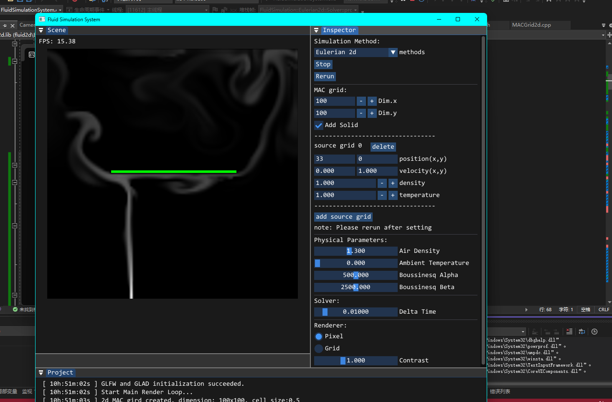
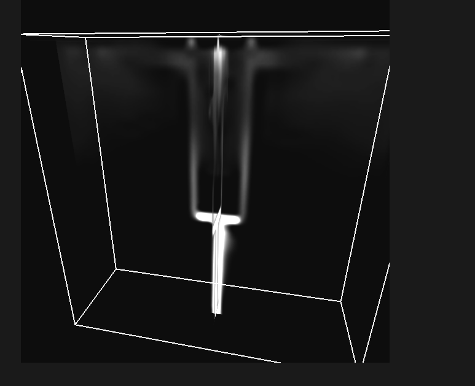

# 计算机图形学大作业A2：网格流体模拟器

刘松卓 2113352 计算机科学与技术

祝天智 2113099 计算机科学与技术

[TOC]

## 问题描述

### 纳维尔－斯托克斯方程

​	流体模拟器的构建是围绕著名的**纳维尔－斯托克斯方程**（Navier-Stokes equations）方程展开的。N-S方程是一组描述流体运动的偏微分方程，本质上是连续介质（流体）中F=ma的应用。N-S方程决定了流体的速度场、密度场等如何随时间演化。因此对流体进行模拟，实际上就是求解该偏微分方程。
$$
\frac{\partial\vec{u}}{\partial t}+\vec{u}\cdot\nabla\vec{u}+\frac1\rho\nabla p=\vec{g}+\nu\nabla\cdot\nabla\vec{u}\\\nabla\cdot\vec{u}=0
$$
​	N-S方程包含两个方程：

- 动量守恒方程：描述的是流体速度随时间的变化量，考虑了流体粒子的质量、外力（如重力）、压力梯度和粘性力。
- 连续性方程：对于不可压缩流体，这意味着流体密度恒定。

​	因为本次实验中，我们仅关注无粘滞的流体，所以令粘度系数为零，忽略最后一项。这样我们就得到了新一组方程，称为欧拉方程，即无黏性流体运动的方程。
$$
\frac{\partial\vec{u}}{\partial t}+\vec{u}\cdot\nabla\vec{u}=\vec{g}-\frac1\rho\nabla p\\\nabla\cdot\vec{u}=0
$$

### 物质导数

​	物质导数即为数学上物理量对时间的全导数。
$$
\frac{\mathrm D()}{\mathrm Dt}=\frac{\partial()}{\partial t}+u\frac{\partial()}{\partial x}+v\frac{\partial()}{\partial y}+w\frac{\partial()}{\partial z}=\frac{\partial()}{\partial t}+\mathbf U\cdot\nabla()
$$
​	因为我们本次实验是使用在欧拉描述下的交错网格表示，所以我们的求解器不能调用拉格朗日粒子，方程左边的物质导数项不能直接求出，所以我们要通过右边来计算，相比于基于粒子的模拟方法，基于欧拉网格的模拟方法多了一项需要计算。
$$
\underbrace{\frac{\mathrm D}{\mathrm Dt}}_{\text{Lagrangian}}=\underbrace{\frac{\partial}{\partial t}+\mathbf U\cdot\nabla}_{\text{Euler}}
$$

​	对于给定的速度场$\vec{u}$， 流体的物理性质如何在这个速度场下变化的计算我们称之为对流。我们构造了一个简单的对流方程即：
$$
\frac{Dq}{Dt}=0\Longrightarrow\frac{\partial q}{\partial t}+\vec{u}\cdot\nabla q=0
$$
​	这个方程意味着在在拉格朗日视角观察下，每个流体粒子的物理量保持不变。

### 分离法

​	首先我们通过

​	有如下微分方程：
$$
\begin{matrix}\frac{dq}{dt}=f(q)+g(q)\end{matrix}
$$
​	我们描述了异格物理量q的变化量，这一部分的变化量是由f和g两部分共同贡献的，我们通过引入中间量，将这一个式子拆分为两部分，在每一部分中，f和g单独作用在q上：
$$
\begin{array}{c}\tilde{q}=q^n+\Delta tf(q^n)\\q^{n+1}=\tilde{q}+\Delta tg(\tilde{q})\end{array}
$$
​	所以我们将N-S方程式1进行分离，得到了如下的三个部分：
$$
\begin{aligned}&\text{对流:}\frac{\partial\boldsymbol{u}}{\partial t}+\boldsymbol{u}\cdot\nabla\boldsymbol{u}=\frac{D\boldsymbol{u}}{Dt}=0\\&\text{外力:}\frac{\partial\boldsymbol{u}}{\partial t}=g\\&\text{投影:}\frac{\partial\boldsymbol{u}}{\partial t}+\frac1\rho\nabla p=0, \nabla\cdot\boldsymbol{u}=0\end{aligned}
$$

1. **对流**：将物理量q通过速度场u跟随流体的速度场进行输送。
2. **外力**：速度受到浮力等外力作用而改变，采用前向欧拉：𝑢←𝑢+Δ𝑡𝑔。
3. **投影**：即采用投影算法，即通过速度场来求解正确的压强。这里压强计算出的结果符合N-S方程，因此我们再用对应压强计算出下一步的速度场，将速度场修正为无散场。

因此我们的算法可以总结为：

初始化速度$\vec{u}_n$,使$\vec{u}_n$无散度

对于每个时间步$n=0,1,2,\ldots$

1. 决定一个合理的时间步长$\Delta t=t_{n+1}-t_n$
2. 对流项计$ \vec{u}_A = advect(\vec{u}_n, \Delta t, \vec{q})$
3. 体积力项计算$\vec{u}_B = \vec{u}_A + \Delta t \vec{g}$
4. 无散度投影$\vec{u}_{n+1} = project(\Delta t, \vec{u}_B)$

```
        void Solver::solve()
        {
            float dt = Eulerian2dPara::dt;

            // 第一步: 对流
            advect(dt);

            // 第二步: 计算外部力
            computeforces(dt);

            // 第三步: 投影
            project(dt);

        }
```

## Staggered Grid网格结构

​	为了让计算更加简便快速，我们将不同类型的物理量被存储于网格的不同位置，如压强保存在网格单元中心，而速度则沿着笛卡尔坐标被分成了两部分。x轴速度保存在网格单元竖直边的中心处，y轴速度保存在网格单元的水平边中心处。这样在数值计算时，我们可以准确地采用中心差分法计算压力梯度和速度的散度。
$$
(\frac{\partial q}{\partial x})_i\approx\frac{q_{i+1/2}-q_{i-1/2}}{\Delta x}
$$
但对于速度可能要做插值才能得到：
$$
\vec{u}_{i,j}=(\frac{u_{i-1/2,j}+u_{i+1/2,j}}2,\frac{v_{i,j-1/2}+v_{i,j+1/2}}2),\\\vec{u}_{i+1/2,j}=(u_{i+1/2,j},\frac{v_{i,j-1/2}+v_{i,j+1/2}+v_{i+1,j-1/2}+v_{i+1,j+1/2}}4),\\\vec{u}_{i,j+1/2}=(\frac{u_{i-1/2,j}+u_{i+1/2,j}+u_{i-1/2,j+1}+u_{i+1/2,j+1}}4,v_{i,j+1/2}).
$$
在2d的交错网格中，对于$n_x * n_y$的网格，压力存储在$n_x * n_y$数组中，速度$u$存储在$(n_x + 1) * n_y$中，速度$v$存储在中，$n_x * (n_y + 1)$中。

## 对流

​	对流的本质是流场的属性随速度场进行变化。空间导数前向欧拉的形式是不稳定的，不论取多小的时间步，都会导致最后模拟的崩溃。因此我们引入了半拉格朗日法。

#### 半拉格朗日法

​	对于位置x处，我们想要研究其物理量q，我们可以找到在上一时间步中即将到达x处的粒子，获取这个粒子的q值。因为这个粒子是我们假象出来的，实际并不存在，这样做只是为了方便我们对对流项进行计算，所以我们称为半拉格朗日对流算法(Semi-Lagrangian Advection)。

​	半拉格朗日对流法的目的就是要找到在n时，经过一个时间步长后，能在$n+1$时到达$x_G$处的$x_P$，最简单的方法就是采用前向欧拉法进行倒推：
$$
\vec{x}_P=\vec{x}_G-\Delta t\vec{u}(\vec{x}_G)
$$
​	若在不改变$\Delta t$的情况下提高精度，我们可以采用高阶的龙格库塔法（Runge-Kutta method）。采用二阶的龙格库塔法如下所示：
$$
\vec{x}_{mid}=\vec{x}_G-\frac12\Delta t\vec{u}(\vec{x}_G),\\\vec{x}_{P}=\vec{x}_G-\Delta t\vec{u}(\vec{x}_{mid}).
$$
​	倒推得到网格位置一般不会恰好在网格顶点上，为此我们采用双线性插值，得到具体的属性值。

#### 代码实现

```
// advectation
            // 对于速度
            FOR_EACH_LINE{
                // 判断是固体或者边界
                if (mGrid.isSolidCell(i, j)) {
                    continue;
                }
                
                // V
                if (i < numX) {
                    glm::vec2 pos_y = mGrid.getBottom(i, j);
                    glm::vec2 new_vel_y = mGrid.semiLagrangian(pos_y, dt);
                    newV(i, j) = mGrid.getVelocityY(new_vel_y);
                }
                
                // U
                
                if (j < numY) {
                    glm::vec2 pos_x = mGrid.getLeft(i, j);
                    glm::vec2 new_vel_x = mGrid.semiLagrangian(pos_x, dt);
                    newU(i, j) = mGrid.getVelocityX(new_vel_x);
                }
                
            }

            // 对于属性
            FOR_EACH_CELL
            {
                // 判断是固体或者边界
                if (mGrid.isSolidCell(i, j)) {
                    continue;
                }
                glm::vec2 pos_p = mGrid.getCenter(i, j);
                glm::vec2 new_vel_p = mGrid.semiLagrangian(pos_p, dt);
                
                newD(i, j) = mGrid.getDensity(new_vel_p);
                newT(i, j) = mGrid.getTemperature(new_vel_p);
            }
```

#### 对流优化

二阶的龙格库塔法的实现

```
// RK2
glm::vec2 MACGrid2d::RK2(const glm::vec2& pt, double dt)
        {
            glm::vec2 velG = getVelocity(pt);
            glm::vec2 xMid = pt - 0.5f * (float)dt * velG;
            glm::vec2 velMid = getVelocity(xMid);
            glm::vec2 xP = pt - (float)dt * velMid;

            xP[0] = max(0.0f, min((dim[0] - 1) * cellSize, xP[0]));
            xP[1] = max(0.0f, min((dim[1] - 1) * cellSize, xP[1]));

            int i, j;

            if (inSolid(xP, i, j))
            {
                double t = 0;
                if (intersects(pt, velMid, i, j, t))
                {
                    xP = pt - (float)t * velMid;
                }
                else
                {
                    Glb::Logger::getInstance().addLog("Error: something went wrong during advection");
                }
            }
            return xP;
        }
```

## 外力

​	速度受到浮力等外力作用而改变，采用前向欧拉：𝑢←𝑢+Δ𝑡𝑔 更新速度即可。

#### 浮力

​	在本次实验中，我们模拟的是烟雾流体，因此考虑的外力还包括浮力。浮力的计算公式如下，浮力的计算框架已经提供。我们只需要将浮力应用到y轴上，更新速度即可。
$$
f_{buoy}=-\alpha\rho\vec{y}+\beta(T-T_{amb})\vec{y}
$$

#### 代码实现

```
// force
        void Solver::computeforces(float dt)
        {
            int numX = mGrid.dim[0];
            int numY = mGrid.dim[1];
            // 浮力
            Glb::GridData2dY newV = mGrid.mV;
            FOR_EACH_CELL
            {
                if (mGrid.isSolidCell(i, j)) {
                    continue;
                }
                if (mGrid.getPressureCoeffBetweenCells(i,j,i,j)<4) {
                    continue;
                }
                
                glm::vec2 pos1 = mGrid.getCenter(i, j);
                glm::vec2 pos0 = mGrid.getCenter(i, j - 1);
                // 向上的作用力
                float bforce1 = mGrid.getBoussinesqForce(pos1);
                float bforce0 = mGrid.getBoussinesqForce(pos0);

                float v = (bforce1 + bforce0) * 0.5 * dt;
                // 更新 v 分量
                newV(i, j) += v;
            }

            mGrid.mV = newV;
        }
```

## 投影

​	根据Helmholtz-Hodge分解定理，每个速度场都是不可压缩场和梯度场的总和。为了获得不可压缩场，我们只需从现在的速度场中，减去梯度场速度即可。



​	上面我们提到，交错网格的表示方法，给计算散度和压强梯度带来了很大的便捷。使用中心差分法计算速度的散度：
$$
(\nabla\cdot\vec{u})_{i,j}\approx\frac{u_{i+1/2,j}-u_{i-1/2,j}}{\Delta x}+\frac{v_{i,j+1/2}-v_{i,j-1/2}}{\Delta x}
$$
​	将二维速度更新公式带入N-S方程式2不可压缩方程，我们进一步得到了如下的方程，也被称为压力泊松方程：
$$
\frac{\Delta t}\rho(\frac{4p_{i,j}-p_{i+1,j}-p_{i,j+1}-p_{i-1,j}-p_{i,j-1}}{\Delta x^2})=-(\frac{u_{i+1/2,j}-u_{i-1/2,j}}{\Delta x}+\frac{v_{i,j+1/2}-v_{i,j-1/2}}{\Delta x})
$$
​	因此接下来，我们只需要求解该方程便可。求解方程我们可以使用雅可比迭代法、高斯塞德尔迭代法或者共轭梯度迭代法等。下面是雅可比迭代法的代码：

```c
            for (int iteration = 100; iteration > 0; iteration--) {
                FOR_EACH_CELL{
                    if (mGrid.isSolidCell(i, j)) {
                        continue;
                    }
                    if (mGrid.isSolidCell(i - 1, j)) {
                        newP(i - 1, j) = newP(i, j) - cellSize * aird * newU(i + 1, j) / dt;
                    }
                    if (mGrid.isSolidCell(i, j - 1)) {
                        newP(i, j - 1) = newP(i, j) - cellSize * aird * newV(i, j + 1) / dt;
                    }
                    double px1 = mGrid.isSolidCell(i + 1, j) ? 0.0 : newP(i + 1, j);
                    double px0 = mGrid.isSolidCell(i - 1, j) ? 0.0 : newP(i - 1, j);

                    double py1 = mGrid.isSolidCell(i, j + 1) ? 0.0 : newP(i, j + 1);
                    double py0 = mGrid.isSolidCell(i, j - 1) ? 0.0 : newP(i, j - 1);
                    

                    double div = mGrid.getDivergence(i, j);
                    // b
                    // double b = -1 * (newU(i + 1, j) - newU(i, j) + newV(i, j + 1) - newV(i, j)) * (aird) * cellSize / (dt);
                    double b = -1 * (div) * (aird) * cellSize * cellSize / (dt);
                    // sum
                    double sum = (px1 + px0 + py1 + py0);
                    double s = mGrid.getPressureCoeffBetweenCells(i, j, i, j);
                    newP(i, j) = (b + sum) / s;
                };
            }
```

​	求解玩压力后，只需要根据压力更新现在的速度，即可满足不可压缩条件：

```c
            FOR_EACH_CELL{
                newU(i + 1,j) -= dt * (newP(i + 1,j) - newP(i,j)) / (cellSize * aird);
                newV(i, j + 1) -= dt * (newP(i, j + 1) - newP(i, j)) / (cellSize * aird);
            }
           	// 边界处理
            
            FOR_EACH_LINE
            {
                // 对U
                if (mGrid.isSolidFace(i, j, MACGrid2d::Direction::X)) {
                    newU(i, j) = 0;
                }
                // 对V
                if (mGrid.isSolidFace(i, j, MACGrid2d::Direction::Y)) {
                    newV(i, j) = 0;
                }
            }
            mGrid.mU = newU;
            mGrid.mV = newV;
            mGrid.mP = newP;
```

​	同样我们还有另外一种实现方式，通过不断遍历将每一个单元格的散度进行分配降低的方式，来实现散度为0的投影过程。就像是从手机屏幕保护膜中推出气泡。



​	如图中，黑色中心的网格，代表了流体为净流入，白色中网格代表了净流出。颜射越多，代表了净流入或者净流出越大。我们的做法是，遍历每一个网格，计算该网格的散度，通过散度更改该网格四条边的速度，以达到该网格散度为0的效果。不断迭代，直到每一个网格的散度都取决于0。





首先，我们计算改单元格(i,j)的散度d，将散度平均分配到每个边上，如果某一边靠近边界，那么该边不参与散度的分配。更新完之后，该单元的散度就变为0。这里我们使用高斯-塞德尔迭代法。以下是代码实现：

```
            for (int iteratenum = 40; iteratenum > 0; iteratenum--) {
                FOR_EACH_LINE
                {
                    
                    if (mGrid.isSolidCell(i, j)) {
                        continue;
                    }
                    double s = mGrid.getPressureCoeffBetweenCells(i, j, i, j);
                    if (s == 0) {
                        continue;
                    }
                    double cp = aird * cellSize / dt;
                    double div = (newU(i + 1, j) - newU(i, j) + newV(i, j + 1) - newV(i, j));
                    double p = - div / s;

                    newP(i, j) += cp * p;

                    newU(i, j) -= p * (!mGrid.mSolid(i - 1, j));
                    newU(i + 1, j) += p * (!mGrid.mSolid(i + 1, j));
                    newV(i, j) -= p * (!mGrid.mSolid(i, j - 1));
                    newV(i, j + 1) += p * (!mGrid.mSolid(i, j + 1));
                
                };
            }
```

## 实验结果





## 二维网格中的并行优化

​	在投影的第二个算法中，我们每次计算只影响该单元上每一条边的速度，所以可以不相邻的单元格可以同时进行计算，也就是说对于N\*N的网格，我们可以拆成两个部分，对于每一部分可以同时计算0.5\*N*N个单元格。即偶数行偶数列和奇数行奇数列可以并行计算，偶数行奇数行和奇数行偶数列可以并行计算。具体拆分如下图：


### 代码实现

```
    for (int iteratenum = 40; iteratenum > 0; iteratenum--)
    {
        // 处理偶数行偶数列和奇数行奇数列
        #pragma omp parallel for collapse(2)
        for (int j = 0; j < numY; j++)
        {
            for (int i = 0; i < numX; i++)
            {
                if ((i + j) % 2 == 0)
                {
                    if (mGrid.isSolidCell(i, j))
                    {
                        continue;
                    }

                    double s = mGrid.getPressureCoeffBetweenCells(i, j, i, j);
                    if (s == 0)
                    {
                        continue;
                    }
                    double cp = airDensity * cellSize / dt;
                    double div = (newU(i + 1, j) - newU(i, j) + newV(i, j + 1) - newV(i, j));
                    double p = -div / s;

                    newP(i, j) += cp * p;

                    newU(i, j) -= p * (!mGrid.mSolid(i - 1, j));
                    newU(i + 1, j) += p * (!mGrid.mSolid(i + 1, j));
                    newV(i, j) -= p * (!mGrid.mSolid(i, j - 1));
                    newV(i, j + 1) += p * (!mGrid.mSolid(i, j + 1));
                }
            }
        }

        // 处理奇数行偶数列和偶数行奇数列
        #pragma omp parallel for collapse(2)
        for (int j = 0; j < numY; j++)
        {
            for (int i = 0; i < numX; i++)
            {
                if ((i + j) % 2 != 0)
                {
                    if (mGrid.isSolidCell(i, j))
                    {
                        continue;
                    }

                    double s = mGrid.getPressureCoeffBetweenCells(i, j, i, j);
                    if (s == 0)
                    {
                        continue;
                    }
                    double cp = airDensity * cellSize / dt;
                    double div = (newU(i + 1, j) - newU(i, j) + newV(i, j + 1) - newV(i, j));
                    double p = -div / s;

                    newP(i, j) += cp * p;

                    newU(i, j) -= p * (!mGrid.mSolid(i - 1, j));
                    newU(i + 1, j) += p * (!mGrid.mSolid(i + 1, j));
                    newV(i, j) -= p * (!mGrid.mSolid(i, j - 1));
                    newV(i, j + 1) += p * (!mGrid.mSolid(i, j + 1));
                }
            }
        }
    }
```

## 二维网格中移动物理的实现

​	在固体边界处，应该有：
$$
\vec u^{n+1}\cdot\hat n=\vec u_{\mathrm{solid}}\cdot\hat n
$$
​	根据诺依曼边界条件，边界处减去压力梯度的时候应该满足固体边界条件，也就是边界速度的法向分量应该等于固体速度的法向分量，也就是边界处下一时刻的速度等于固体的速度，得到了固体边界的压力计算公式：
$$
p_{i+1,j}=p_{i,j}+\frac{\rho\Delta x}{\Delta t}\begin{pmatrix}u_{i+1/2,j}-u_{\mathrm{solid}}\end{pmatrix}
$$

```
    for (int j = 0; j < numY; ++j)
    {
        mGrid.mU(0, j) = mGrid.getSolidVelocityX(0, j);
        mGrid.mP(1, j) = mGrid.mP(0, j) + (rho * dx / dt) * (mGrid.mU(0, j) - mGrid.getSolidVelocityX(0, j));
        if (j > 0) mGrid.mV(0, j) = mGrid.mV(1, j);
        if (j < numY - 1) mGrid.mV(0, j + 1) = mGrid.mV(1, j + 1);

        mGrid.mU(numX, j) = mGrid.getSolidVelocityX(numX, j);
        mGrid.mP(numX - 1, j) = mGrid.mP(numX, j) + (rho * dx / dt) * (mGrid.mU(numX, j) - mGrid.getSolidVelocityX(numX, j));
        if (j > 0) mGrid.mV(numX - 1, j) = mGrid.mV(numX - 2, j);
        if (j < numY - 1) mGrid.mV(numX - 1, j + 1) = mGrid.mV(numX - 2, j + 1);
    }

    for (int i = 0; i < numX; ++i)
    {
        mGrid.mV(i, 0) = mGrid.getSolidVelocityY(i, 0);
        mGrid.mP(i, 1) = mGrid.mP(i, 0) + (rho * dx / dt) * (mGrid.mV(i, 0) - mGrid.getSolidVelocityY(i, 0));
        if (i > 0) mGrid.mU(i, 0) = mGrid.mU(i, 1);
        if (i < numX - 1) mGrid.mU(i + 1, 0) = mGrid.mU(i + 1, 1);

        mGrid.mV(i, numY) = mGrid.getSolidVelocityY(i, numY);
        mGrid.mP(i, numY - 1) = mGrid.mP(i, numY) + (rho * dx / dt) * (mGrid.mV(i, numY) - mGrid.getSolidVelocityY(i, numY));
        if (i > 0) mGrid.mU(i, numY - 1) = mGrid.mU(i, numY - 2);
        if (i < numX - 1) mGrid.mU(i + 1, numY - 1) = mGrid.mU(i + 1, numY - 2);
    }
```

## 三维网格法实现

​	与二维网格法类似，同样需要对流、应用外力、投影三个步骤。

### 对流

```
            FOR_EACH_FACE
            {
                if (mGrid.isSolidCell(i, j, k)) {
                    continue;
                }
                glm::vec3 pos_x = mGrid.getBack(i, j, k);
                glm::vec3 new_vel_x = mGrid.semiLagrangian(pos_x, dt);
                newU(i, j, k) = mGrid.getVelocityX(new_vel_x);

                glm::vec3 pos_y = mGrid.getLeft(i, j, k);
                glm::vec3 new_vel_y = mGrid.semiLagrangian(pos_y, dt);
                newV(i, j, k) = mGrid.getVelocityY(new_vel_y);

                glm::vec3 pos_z = mGrid.getBottom(i, j, k);
                glm::vec3 new_vel_z = mGrid.semiLagrangian(pos_z, dt);
                newW(i, j, k) = mGrid.getVelocityZ(new_vel_z);
                
            }

            FOR_EACH_CELL
            {
                if (mGrid.isSolidCell(i, j, k)) {
                    continue;
                }
                glm::vec3 pos_p = mGrid.getCenter(i, j, k);
                glm::vec3 new_vel_p = mGrid.semiLagrangian(pos_p, dt);

                newD(i, j, k) = mGrid.getDensity(new_vel_p);
                newT(i, j, k) = mGrid.getTemperature(new_vel_p);
            }
```

### 应用外力

```
            FOR_EACH_CELL
            {
                if (mGrid.isSolidCell(i, j, k)) {
                    continue;
                }

                if (mGrid.getPressureCoeffBetweenCells(i, j, k, i, j, k) < 6) {
                    continue;
                }

                glm::vec3 pos1 = mGrid.getCenter(i, j, k);
                glm::vec3 pos0 = mGrid.getCenter(i, j, k - 1);

                float bforce1 = mGrid.getBoussinesqForce(pos1);
                float bforce0 = mGrid.getBoussinesqForce(pos0);

                float w = (bforce1 + bforce0) * 0.5 * dt;
                newW(i, j, k) += w;
            }
```

### 投影

```
            // 初始化压力
            FOR_EACH_CELL{
                newP(i, j, k) = 0;
            }

                // 迭代计算压力
            for (int iteration = 100; iteration > 0; iteration--) {
                FOR_EACH_CELL{
                    if (mGrid.isSolidCell(i, j, k)) {
                        continue;
                    }

                    double px1 = mGrid.isSolidCell(i + 1, j, k) ? 0.0 : newP(i + 1, j, k);
                    double px0 = mGrid.isSolidCell(i - 1, j, k) ? 0.0 : newP(i - 1, j, k);

                    double py1 = mGrid.isSolidCell(i, j + 1, k) ? 0.0 : newP(i, j + 1, k);
                    double py0 = mGrid.isSolidCell(i, j - 1, k) ? 0.0 : newP(i, j - 1, k);

                    double pz1 = mGrid.isSolidCell(i, j, k + 1) ? 0.0 : newP(i, j, k + 1);
                    double pz0 = mGrid.isSolidCell(i, j, k - 1) ? 0.0 : newP(i, j, k - 1);

                    double div = mGrid.getDivergence(i, j, k);

                    double b = -1 * div * airDensity * cellSize * cellSize / dt;
                    double sum = px1 + px0 + py1 + py0 + pz1 + pz0;
                    double s = mGrid.getPressureCoeffBetweenCells(i, j, k, i, j, k);
                    newP(i, j, k) = (b + sum) / s;
                }
            }

            // 调整速度场
            FOR_EACH_CELL{
                newU(i + 1, j, k) -= dt * (newP(i + 1, j, k) - newP(i, j, k)) / (cellSize * airDensity);
                newV(i, j + 1, k) -= dt * (newP(i, j + 1, k) - newP(i, j, k)) / (cellSize * airDensity);
                newW(i, j, k + 1) -= dt * (newP(i, j, k + 1) - newP(i, j, k)) / (cellSize * airDensity);
            }

            // 边界处理
            FOR_EACH_CELL
            {
                if (mGrid.isSolidFace(i, j, k, MACGrid3d::Direction::X)) {
                    newU(i, j, k) = 0;
                }
                if (mGrid.isSolidFace(i, j, k, MACGrid3d::Direction::Y)) {
                    newV(i, j, k) = 0;
                }
                if (mGrid.isSolidFace(i, j, k, MACGrid3d::Direction::Z)) {
                    newW(i, j, k) = 0;
                }
            }
```

### 实验结果



## 总结

### 实验结果

​	通过实现基于纳维尔－斯托克斯方程的网格流体模拟器，成功模拟了流体在二维和三维空间中的运动。实验结果显示，使用分离法处理对流、外力和投影部分，可以有效地模拟流体的动态行为，并且在合理的时间内获得高质量的仿真结果。

### 讨论

​	在实验过程中，我们观察到使用交错网格方法可以减少数值粘性，从而更精确地捕捉流体的对流特性。然而，在高速流动情况下，可能会出现数值不稳定，需要进一步改进。投影步骤将速度场调整为无散度场，使得流体满足不可压缩条件。投影的算法会影响模拟性能，因而可以使用并行计算的方法来对网格速度的更新。同时投影步骤中的迭代次数和收敛标准对模拟结果有显著影响，需要在效率和准确性之间找到平衡。

### 改进和扩展

1. **高效求解器**：引入更高效的数值求解器，如多重网格方法或快速傅里叶变换，可以加速计算过程。
2. **涡量方法**：涡量方法在模拟复杂流动方面具有优势，可以尝试将其与当前方法结合，提升模拟精度。
3. **界面处理**：在多相流体模拟中，界面处理是一个重要问题。未来可以探索界面捕捉或追踪算法，提升多相流体模拟的表现。
4. **并行计算**：利用GPU并行计算能力，可以显著提升模拟效率，适用于大规模复杂流体模拟。

## 参考文献

[Real-time Eulerian fluid simulation on a Macbook Air, using GPU shaders](https://www.youtube.com/watch?v=x6mcua0HOJs)

[Real-Time Fluid Dynamics for Games](https://www.researchgate.net/publication/2560062_Real-Time_Fluid_Dynamics_for_Games )

[流体模拟Fluid Simulation：求解流体不可压缩的泊松方程](https://yangwc.com/2019/08/03/MakingFluidImcompressible/ )

[Fluid Simulation for Dummies](https://mikeash.com/pyblog/fluid-simulation-for-dummies.html)

[Visual Simulation of Smoke](https://web.stanford.edu/class/cs237d/smoke.pdf)
